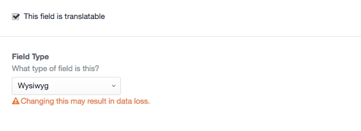
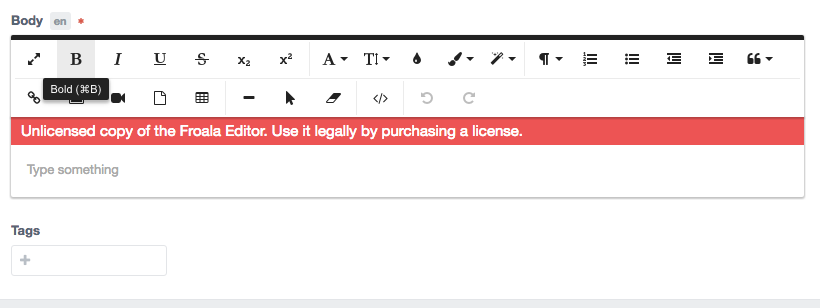

## Please Note
You must create 2 folders with name `wysiwyg` and `wysiwyg_files` in your `uploads` folder.

- `wysiwyg` folder is images storage
- `wysiwyg_files` folder is files storage
## How to setup

After install plugin, you need create an config file called name `wysiwyg.php` in `craft/config` folder with content:

```php
<?php

return array(
	"plugins" => array(
		"table","image","video", "code_view", "colors", "fullscreen", "file", "image_manager",
		"font_family" => array("css" => false),
		"inline_style" => array("css" => false),
		"link" => array("css" => false),
		"lists" => array("css" => false),
		"paragraph_format" => array("css" => false),
		"paragraph_style" => array("css" => false),
		"line_breaker" => array("css" => false),
		"quote" => array("css" => false),
		"word_paste" => array("css" => false),
		"code_beautifier" => array("css" => false),
		"font_size" => array("css" => false),
	),
	"third_party" => array(
		"image_aviary" => array("css" => false),
	)
);

```


## How to use





